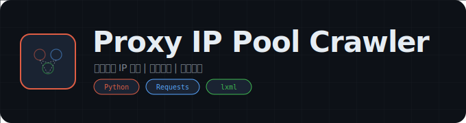

  

  # Proxy IP Pool Crawler

  **免费代理 IP 分布式爬虫**

  
  

---

## 概述

免费代理 IP 爬取与验证工具，从多个公开代理源抓取 IP，自动验证可用性，构建可用代理池。

## 功能特性

- **多源爬取** -- 从多个免费代理网站抓取 IP
- **自动验证** -- 自动检测代理可用性和响应速度
- **分布式架构** -- 支持分布式爬取模式

## 免责声明

本工具仅供学习研究使用，请遵守相关法律法规。